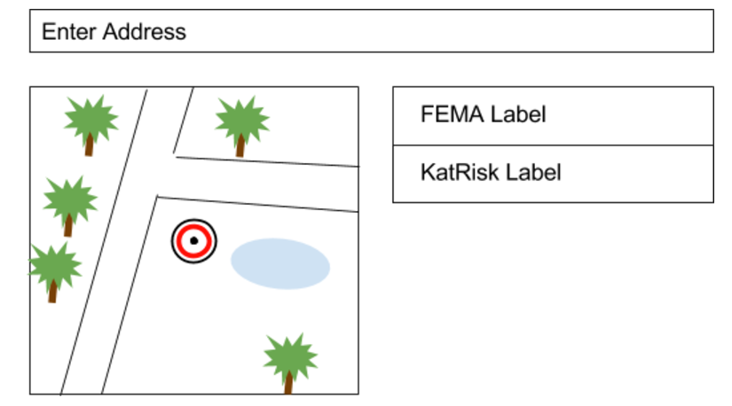
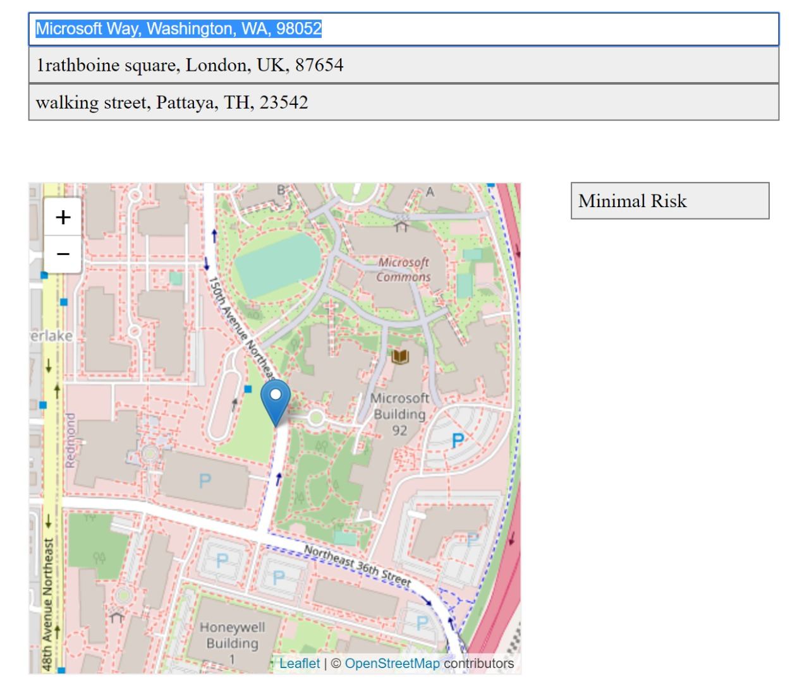

## SpatialKey Software Engineer, Front End - Interview Exercise

Kathy is an Underwriter.  Her job is to assess the risk of a given location, along with other factors, to make decisions about pricing policies. Typically she is only given the address of a location and must manually cross-reference an address against different Risk Modelers maps, one by one, to determine the level of risk. This is done in the browser and across different websites for each Risk Modeler. Since each Risk Modeler has their own methodology for determining the risk, she likes to view the results side by side for comparison, so she copies her findings into a spreadsheet. She also likes to see where the location is on the map to gain confidence in the results.

You are tasked with unifying Kathy’s current process into a single page application.

## What's Included:
* A very rough wireframe to help visualize the concept
* A barebones index.html file stubbed with mock api calls

## Wireframe

  
## About the Mock API

* You must update these calls to be "async" with a time delay, as if it were a real call
* You may extend the functionality of these api calls to be more dynamic and/or include additional results
* The values Kathy needs to compare are:
    * sk_risk_fema (For FEMA)
    * sk_risk_katrisk (For KatRisk)

## Requirements
* You must provide an estimated completion date
* You must write it in HTML, CSS and JavaScript
* You must include any instructions necessary to build the project
* You may use any libraries or frameworks or none at all
* You may use any mapping library to display the location on the map
* You may add any UI enhancements you think might be important to Kathy

## Upon Completion
* Push to a new branch on this repository
* Submit a pull request to the master branch
* Send us an email (in case we miss the PR notification)
* At this point, the team will be notified to review your project

## Considerations
* Are you comfortable sharing this work?
    * We understand this is an off hours exercise, but want you to be proud enough to share it
* Various tech team members who've never met you will be pulling this project down to review it
    * Be sure it works upon clean install and make note of any special instructions
    * Use your README to include any additional thoughts or context to explain your work
* Don't be afraid to ask questions along the way

## Output screenshot

